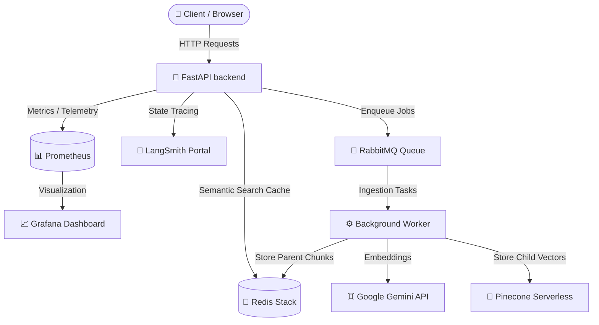

# 🛡️ Enterprise RAG Platform - Observability & Monitoring Guide

Welcome to the **Enterprise RAG Platform Observability and Telemetry Guide**. This document serves as a complete handbook for monitoring, tracing, debugging, and auditing your end-to-end agentic RAG pipeline.

Your platform is integrated with industry-standard, professional-grade observability tools. Together, they monitor every layer of the system—from system infrastructure (CPU, RAM, API response rates) to RAG-specific AI telemetry (state transitions, latency breakdowns, tokens, caching, and vector storage).

---

## 🗺️ Telemetry Stack Overview

---

## 🚀 Dashboards Directory & Access Keys

| Service / Dashboard | URL | Access Credentials | Primary Use Case |
| :--- | :--- | :--- | :--- |
| **LangSmith** | [smith.langchain.com](https://smith.langchain.com) | *Pre-configured API Key* | AI Tracing, Token counting, Prompt auditing, Latency profiling |
| **RedisInsight GUI** | [http://localhost:8001](http://localhost:8001) | None (Auto-connects) | Key-value browser, Semantic cache browser, Parent document reader |
| **RabbitMQ Management** | [http://localhost:15672](http://localhost:15672) | User: `guest` Pass: `guest` | Async task queue visualizer, message rates, background consumer health |
| **Grafana** | [http://localhost:3001](http://localhost:3001) | User: `admin` Pass: `admin` | System performance dashboard, memory usage, API error rates |
| **Prometheus** | [http://localhost:9090](http://localhost:9090) | None | Core backend HTTP metric scraping |

---

## 🌟 1. LangSmith: Deep RAG & StateGraph Auditing

LangSmith is the absolute gold standard for tracing LangGraph executions. The platform is pre-configured to capture and map every single execution tree.

### ❓ Why We Use It:
Stochastic AI models cannot be debugged with traditional line-by-line code debuggers. When a RAG response is wrong, you need to know exactly:
- Did the retrieval fetch the wrong chunks?
- Did the reranker filter out the right chunks?
- Was the prompt template malformed?
- Did the LLM experience a hallucination?
LangSmith acts as a x-ray machine for your RAG pipeline, providing a clear visual audit of every single variable, API call, token count, and prompt during the generation.

### 🔌 How It Works in the Background:
The FastAPI backend imports LangChain's native callback registry. Every time you run the graph (`rag_workflow.ainvoke` or `rag_workflow.astream_events`), LangChain automatically captures the input state, intermediate variables, execution time, and model calls. 
It pushes these trace payloads asynchronously to LangSmith's API endpoints in the background, ensuring **zero performance overhead** or delay to your active user's HTTP request.

### What to Monitor:
1. **The Graph State Tree**: It renders a visual node chart of each chat request. You will see green checkboxes as the workflow navigates through `check_cache` ➡️ `guardrails` ➡️ `retrieve` ➡️ `generate`.
2. **Exact Prompt Inspection**: Click on the `generate` node to see the exact formatted prompt (with the retrieved context injection) sent to the **Gemini 2.5 Flash** model.
3. **Pinecone Retrieval Trace**: Click on the `retrieve` node to inspect the raw child vectors returned by Pinecone (including their metadata, distance score, and namespace).
4. **Token Usage and Cost**: See a detailed count of **Prompt Tokens**, **Completion Tokens**, and **Total Tokens** consumed by each Gemini call to audit API billing.
5. **Node Latency Profiling**: Find out exactly which step is slowing down your queries (e.g. how many milliseconds Pinecone takes vs. Cohere Reranker vs. LLM generation).

> [!TIP]
> Under your project **`enterprise-rag-platform`** on LangSmith, look out for runs marked with `cache_hit: true` to identify repeated query patterns that saved you 100% of LLM cost!

---

## 🔴 2. RedisInsight: Visual Data & Cache Explorer

Redis Stack handles semantic caching, retrieval caching, and the large **Parent Chunk Store**. RedisInsight provides a clean, visual browser to view these entries.

### ❓ Why We Use It:
1. **Cost & Latency Reduction**: Querying LLMs and vector databases for repetitive questions is expensive and slow. Redis checks queries and serves cached answers in `<2ms` at zero cost.
2. **Retrieval Protection**: By caching search results from Pinecone, we prevent hitting external rate limits and protect database read bandwidth.
3. **Context Recovery**: Storing large, high-fidelity PDF chunks directly in Pinecone is extremely expensive and causes search noise. Instead, we index tiny, semantic "child chunks" in Pinecone, and store their large original "parent chunks" in Redis. This is called **Parent-Child Retrieval**, yielding high semantic accuracy with maximum generation context!

### 🔌 How It Works in the Background:
- **During Ingestion**: The worker splits documents. It upserts the tiny child text vectors (100-200 tokens) to Pinecone. At the exact same time, it saves the parent block (1000 tokens) in Redis using the key pattern `parent_chunk:<id>`.
- **During Querying**: When Pinecone matches a child chunk, the backend instantly issues a bulk `MGET` request to Redis using the child's `parent_id` metadata. Redis returns the full context text in microseconds, and the backend injects this context into Gemini!

### Key Types and Patterns to Explore:
* **`parent_chunk:<id>`**: Stores the large, fully-detailed text segments of your uploaded PDFs. When Pinecone matches a tiny child vector, the system queries this key pattern to load the original high-fidelity context document.
* **`semantic_cache:<query_hash>`**: Stores exact or semantically similar queries and their completed RAG responses. If a user asks the same question, the system skips LLM reasoning and serves it in `<2ms`.
* **`retrieval_cache:<query_hash>`**: Stores the Pinecone/Cohere retrieval results. If the cache is hit, it skips hitting the Pinecone API, protecting your Pinecone rate limits.

---

## 🐇 3. RabbitMQ Management Console

RabbitMQ is the backbone of your asynchronous ingestion system. When a document is uploaded, it is placed on a durable message broker.

### ❓ Why We Use It:
Document ingestion is a heavy, CPU-bound workload. It involves parsing PDFs, running regular expressions, text chunking, and calculating large embeddings.
If we ran this work synchronously inside the FastAPI thread pool (during the HTTP upload request):
- The server's main threads would lock up completely.
- A user's browser would time out waiting for the response.
- Multiple simultaneous uploads would crash the backend container.
RabbitMQ decouples your API. The API instantly responds "Queued" to the user, and RabbitMQ guarantees that every document is processed safely, in order, without ever losing a file.

### 🔌 How It Works in the Background:
1. **The Producer**: When you upload a file on the frontend, the FastAPI backend saves the PDF to the shared `/tmp/uploads` volume and publishes a transaction message to the RabbitMQ queue (`document_ingestion`).
2. **The Broker**: RabbitMQ stores this task in its persistent, crash-proof disk storage.
3. **The Consumer (Worker)**: Your background `worker` container is connected to the queue with a `prefetch_count=1` limit. It pulls exactly one task, reads the PDF from the shared volume, processes it, and upserts vectors.
4. **The ACK**: Only when vector upsertion is 100% successful does the worker send an **Acknowledge (ACK)** packet to RabbitMQ, which then safely deletes the task. If the worker crashes, the task is automatically re-queued and retried!

### Key Features to Watch:
* **`document_ingestion` Queue**: Under the **Queues** tab, click on `document_ingestion`. You will see a real-time graph of pending (Ready) messages, unacknowledged (Unacked) messages, and total queue depth.
* **Worker Health (Consumers)**: Look at the bottom of the queue details. It will display `1 active consumer` connected, which is your containerized `worker` script listening for documents.
* **Task Acknowledgment (ACK/NACK)**: If a PDF parsing job fails (e.g., corrupt file), RabbitMQ will show red NACK spikes. Successful imports show clean green ACK rates.

---

## 📊 4. Prometheus & Grafana System Monitoring

This layer monitors the health, HTTP latency, and stability of your API Gateway and containers.

### ❓ Why We Use It:
Traditional logging only captures individual text lines when something goes wrong. However, you cannot use raw logs to understand long-term historical performance:
- Are API response latencies climbing as traffic grows?
- Is there a memory leak slowly eating up container RAM over weeks?
- What are the peak traffic times of your platform?
Prometheus serves as a high-performance timeseries registry to collect numeric data points, and Grafana maps these numbers into beautiful dashboards so you can easily spot trends, memory leaks, and traffic bottlenecks before they cause downtime!

### 🔌 How It Works in the Background:
1. **The Exporter**: The FastAPI backend exposes an internal `/metrics` registry endpoint.
2. **The Pull (Scrape)**: Every 15 seconds, the **Prometheus** container sends a GET request to `http://backend:8000/metrics`. It parses the numbers and saves them in its highly optimized Local Timeseries Database (TSDB).
3. **The Query**: **Grafana** connects to Prometheus over Docker's internal bridge network. It sends PromQL queries and draws visual graphs of your server's health.

### 🔑 Grafana Login Credentials:
* **Default Username**: `admin`
* **Default Password**: `admin`
* **Initial Setup**: On your very first login at `http://localhost:3001`, Grafana will prompt you to change this default password to any password of your choice. You can either input a new password or click **Skip** to keep using `admin`.

### 🔌 How to Connect Prometheus to Grafana:
To import and monitor your RAG metrics, you must link the Prometheus service inside Grafana:
1. **Navigate to Data Sources**: On the Grafana sidebar, click on the **Connections** icon (cog/plug) ➡️ **Data Sources** ➡️ Click **Add data source**.
2. **Select Prometheus**: Click on the **Prometheus** card.
3. **Configure URL**: In the **Connection** settings, enter:
   * **`http://prometheus:9090`** (this leverages Docker's internal DNS network name!)
4. **Save & Test**: Scroll to the bottom of the page and click **Save & Test**. You will see a green checkmark indicating *"Data source is working"*.
5. **Create a Dashboard**: Click **Create Dashboard** or **Import** to start plotting metrics like:
   * `fastapi_requests_total` (tracks API traffic volume)
   * `http_requests_total` (tracks HTTP responses and latency percentiles)
   * `process_cpu_seconds_total` (tracks resource consumption of backend/worker containers)

### Key Performance Indicators (KPIs) to Track:
* **HTTP Request Latency**: Watch the 95th and 99th percentile response latencies of the `/api/chat` and `/api/ingest` routes.
* **Container Health**: Resource consumption (CPU/RAM) profiles of the `backend` and `worker` processes.
* **Error Rate Tracking**: Real-time counter of `5xx` Internal Server Errors or `429` Rate-Limiting triggers.

---

## 🛠️ Step-by-Step Debugging & Auditing Scenarios

### ❓ Scenario A: "A user complained about a slow RAG response. How do I trace where the bottleneck was?"
1. Log into your **LangSmith Portal** and click on your latest run in the list.
2. Look at the right sidebar to see the **Total Execution Latency** (e.g., `1.84s`).
3. Expand the nested step nodes:
   * **`retrieve`**: Took `620ms` (indicates Pinecone query + Cohere Reranker took this long).
   * **`generate`**: Took `1.12s` (indicates the time Gemini spent writing the answer).
4. *Verdict*: If `retrieve` is slow, optimize Pinecone index filters. If `generate` is slow, switch to an even lighter model or check your network routing.

---

### ❓ Scenario B: "I uploaded Leave-Policy.pdf, but the status is queued. How do I check if it processed successfully?"
1. Open the **RabbitMQ Management Dashboard** (`http://localhost:15672`).
2. Go to **Queues** ➡️ `document_ingestion`.
3. Check the graph:
   * If **Ready** is `0` and **Total** is `0`, it has finished processing.
   * If there is an **Unacked** message, the worker is currently writing it to Pinecone.
4. Next, open **RedisInsight** (`http://localhost:8001`) and search for keys matching `parent_chunk:*`. If they exist, the document was successfully split, stored, and the embeddings are now in Pinecone!

---

### ❓ Scenario C: "How do I prove that the Semantic Cache is actually saving me API costs?"
1. Ask the same question twice in your Web UI (e.g., "What is the sick leave policy?").
2. Open **LangSmith** and examine the two execution logs:
   * **Run 1**: The tree will show `check_cache` (returning no output) ➡️ `guardrails` ➡️ `retrieve` ➡️ `generate` (showing cost, e.g., 850 tokens).
   * **Run 2**: The tree will show *only* `check_cache` (returning cached answer) and direct route to **`END`**. The token count will be **`0 tokens`**, showing that the user was served instantly at zero cost!
