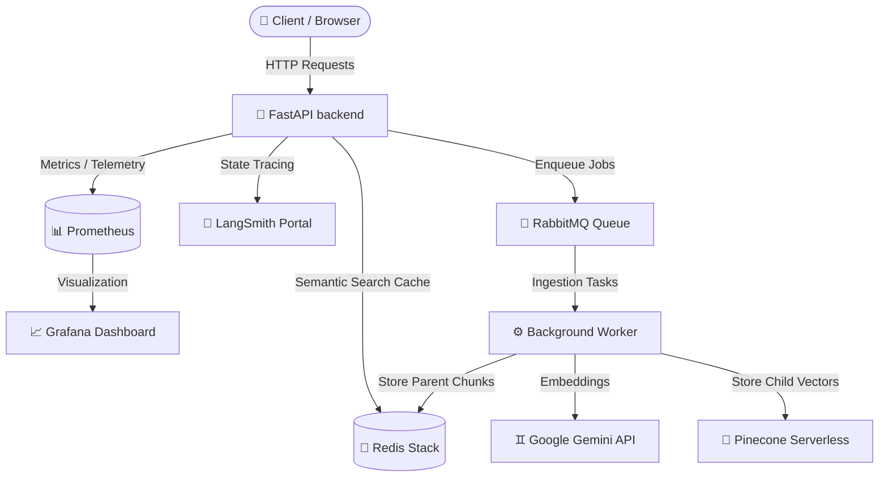

# 🚀 Enterprise Multi-Tenant RAG Platform

Welcome to the **Enterprise RAG Platform**—a production-grade, highly optimized, multi-tenant Retrieval-Augmented Generation (RAG) platform. This platform is built to solve real-world enterprise AI requirements: sub-second hybrid retrieval, hallucination mitigation, strict data boundaries, intelligent caching, resilient message queuing, and professional-grade observability.

---

## 🗺️ System Architecture & Workflow

Below is the high-level data flow and architecture topology of the platform:



---

## 🔑 Infrastructure Directory, Credentials & Ports

The platform runs entirely containerized under Docker Compose. Below is the mapping of all services, their local URLs, and default access credentials:

| Service / UI Dashboard | Host URL | Port Map | Default Credentials | Purpose |
| :--- | :--- | :--- | :--- | :--- |
| **Frontend Web App** | `http://localhost:3002` | `3002:3000` | None | Next.js chat interface & document dashboard |
| **Backend API Gateway**| `http://localhost:8000` | `8000:8000` | None | FastAPI backend routes & `/docs` (OpenAPI Swagger) |
| **RabbitMQ Management** | `http://localhost:15672` | `15672:15672`<br>`5672:5672` | Username: `guest`<br>Password: `guest` | Message queue monitor, consumer rate grapher |
| **RedisInsight GUI** | `http://localhost:8001` | `8001:8001`<br>`6379:6379` | None (Auto-connects) | Key-value explorer, vector search cache auditor |
| **Grafana Dashboard** | `http://localhost:3001` | `3001:3000` | Username: `admin`<br>Password: `admin` | Real-time system health and API rate monitoring |
| **Prometheus TSDB** | `http://localhost:9090` | `9090:9090` | None | System metrics scraping engine |
| **LangSmith Portal** | [smith.langchain.com](https://smith.langchain.com) | Cloud API | *Configured via API Key* | LLM call tracing, graph inspection, prompt auditing |

---

## 🛠️ Tech Stack & Key Concepts Explanations

### 1. LangGraph Orchestration & Flow Control
Unlike basic sequential chain scripts, the RAG agent utilizes **LangGraph** to construct a state-driven execution graph. This architecture supports:
*   **Structured State Tracking**: A central state dict stores the user query, tenant identifier, fetched documents, cache status, and guardrail decisions.
*   **Conditional Branching**: The graph checks for cached answers or safety alerts at the entry nodes and exits early if a response is already available or if the query violates safety guardrails.
*   **Compiled Graph Streaming**: Using LangGraph's native `astream_events` API, the FastAPI backend streams model tokens chunk-by-chunk to the Next.js frontend in real-time.

### 2. Multi-Layer Caching (Redis Stack)
To optimize response latency and minimize model and database costs, we implement a multi-tier cache using **Redis Stack**:
*   **Semantic Cache (Vector Similarity Search)**: Utilizes Redis Stack's native HNSW index. User query embeddings are generated and checked against previous queries using a Cosine Distance threshold (>= 88% similarity). If a match is found, the system serves the cached response in `<2ms`.
*   **Exact SHA-256 Fallback Cache**: Provides a standard fallback matching exact duplicate queries.
*   **Retrieval Cache**: Stores document chunks returned by Pinecone/Cohere for a query, protecting Pinecone read bandwidth.
*   **Embedding Cache**: Caches chunk-to-vector pairs during ingestion to save API embedding costs.

### 3. Ingestion Pipeline & Parent-Child Chunking
Traditional RAG systems embed large chunks (e.g., 1000-2000 tokens), which dilute semantic retrieval vectors. Alternatively, embedding tiny chunks (e.g., 100-200 tokens) keeps retrieval high-quality, but deprives the LLM of necessary context.
*   **Our Solution (Parent-Child Retrieval)**: 
    1. During ingestion, documents are parsed. The worker breaks the document into large **Parent** chunks (approx. 1000+ tokens) and saves them in Redis mapped by a unique `parent_id`.
    2. The worker splits each Parent chunk further into tiny **Child** chunks (approx. 100-200 tokens).
    3. These Child chunks are embedded using **Gemini Embeddings** and upserted to Pinecone, storing the `parent_id` as metadata.
    4. At retrieval time, the system searches Pinecone for the tiny Child vectors, and then fetches the original, complete Parent chunks from Redis.

### 4. Hybrid Search & Reranking
*   **Dense + Sparse Hybrid Search**: Employs **Pinecone Serverless** for high-dimensional semantic search combined with a local **BM25 Sparse Encoder** for exact keyword/code token matching.
*   **Cohere Reranking**: Pinecone returns the top 15-30 results. These are forwarded to the **Cohere Reranker**, which performs deep transformer cross-attention scoring. The top results are filtered down to the most relevant top 3-5 documents, minimizing token noise.

### 5. Multi-Tenant Data Isolation
Enterprise environments require strict data privacy boundaries. 
*   **Pinecone Namespaces**: When a tenant uploads a document or runs a query, the backend strictly scopes the Pinecone index query using the `tenant_id` namespace parameter. Data is mathematically separated inside the vector database, preventing cross-tenant leakage.

### 6. Guardrails & Output Validation
*   **Llama Guard Mock Validator**: Pre-generation check running on the query input string. It detects and rejects common adversarial patterns such as prompt injections, system prompt disclosures, and toxic content.
*   **NeMo Guardrails Output Validator**: Post-generation check running on the LLM output. It scans responses to prevent system leaks or malformed output formats.

### 7. Observability Stack
*   **Prometheus & Grafana**: The FastAPI backend exposes API metrics via `/metrics` (using `prometheus_client`). Prometheus scrapes this data every 15 seconds, and Grafana maps it to visualize API traffic patterns, latency percentiles, and resource usage.
*   **LangSmith**: Traces every node execution inside LangGraph. It charts performance bottlenecks, shows exact input/output states of each node, and reports exact prompt token usage and cost.

---

## 🏃 Quick Start Guide

### 📋 Prerequisites
1.  Ensure you have **Docker Desktop** installed and running.
2.  Provide a minimum of **8 GB RAM** to your Docker VM.
3.  Obtain and insert your credentials into a `.env` file at the root:
    ```bash
    cp .env.example .env
    ```

### ▶️ Run Services
Start the entire stack in the background (detached mode):
```bash
docker-compose up --build -d
```

Check the status of running containers:
```bash
docker-compose ps
```

### 🔍 View System Logs
Stream logs from the FastAPI backend and Background Worker:
```bash
docker-compose logs -f backend worker
```

### 🛑 Tear Down System
Stop the containers and remove temporary volumes (clears Redis & RabbitMQ databases):
```bash
docker-compose down -v
```

---

## 📊 Connecting Grafana to Prometheus

On your first start-up, Grafana needs to be connected to Prometheus to gather backend metrics:
1.  Open **Grafana** at `http://localhost:3001` and log in (User: `admin`, Pass: `admin`).
2.  Navigate to **Connections** ➡️ **Data Sources** ➡️ Click **Add data source**.
3.  Select **Prometheus**.
4.  In the **Connection** settings, enter the Docker-internal URL:  
    `http://prometheus:9090`
5.  Scroll to the bottom and click **Save & Test**. You will see a green confirmation dialog indicating that the data source is connected.
